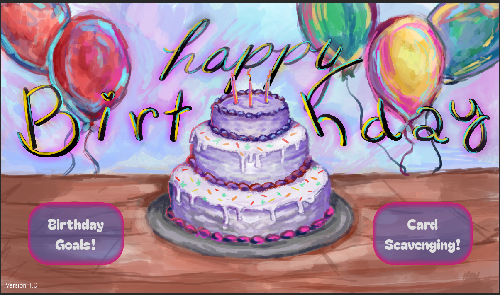

# Birthday Fun!
A little game made for peoples' birthdays. Y'know, just for spirit's sake. Less of a game and more of a fun and quick pick-me-up!
I made this as a project for the birthday-cards-ysws for HackClub, lol.

What can you do in this little program? Well, you can open birthday cards, and get a list of things you can do for your birthday.

How do you access the project to play in web, or to download as a game build? Go to this link in itch.io:
https://blueheart-elf.itch.io/birthday-fun-a-mini-project-thingy

Just click download on the build for your device, and then run the application, by clicking on "Godot Application" in the folder directory.

Since this is under the MIT license, feel free to use this project however you'd like. If you want to add stages or modify the birthday messages for a loved one, just download the code from this repository by clicking on "Code" and then cloning it. You can redownload the package as a game in the Godot Builder.

Have fun, and keep creating!

Credits:
- Art by arislam-cs28, in Krita
- Code by arislam-cs28, in Godot Game Engine
- Music made by arislam-cs28, in Bandlab
	
